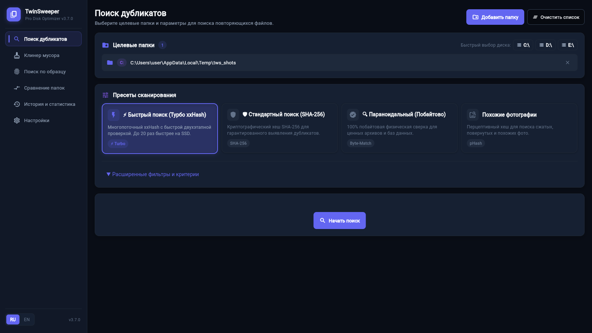
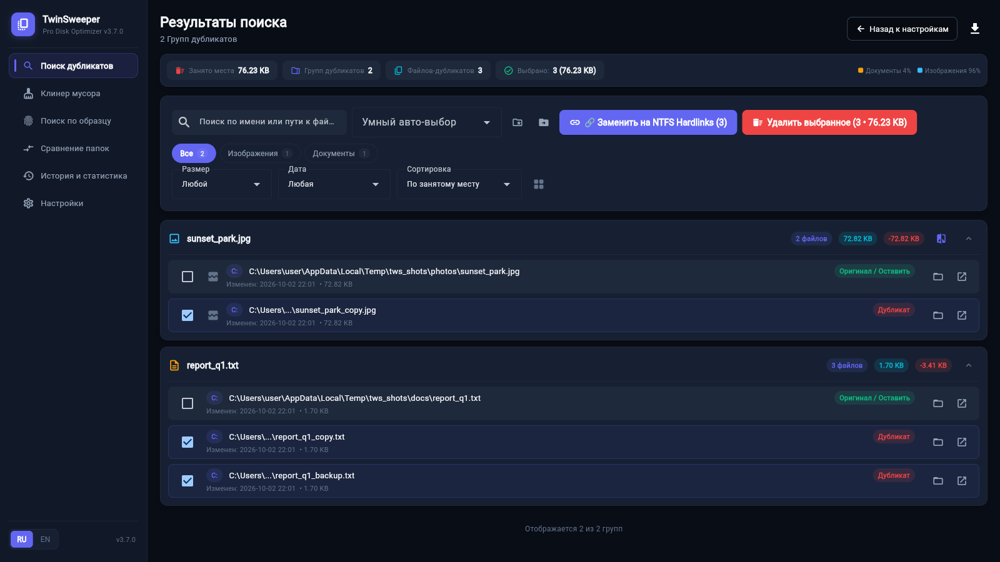
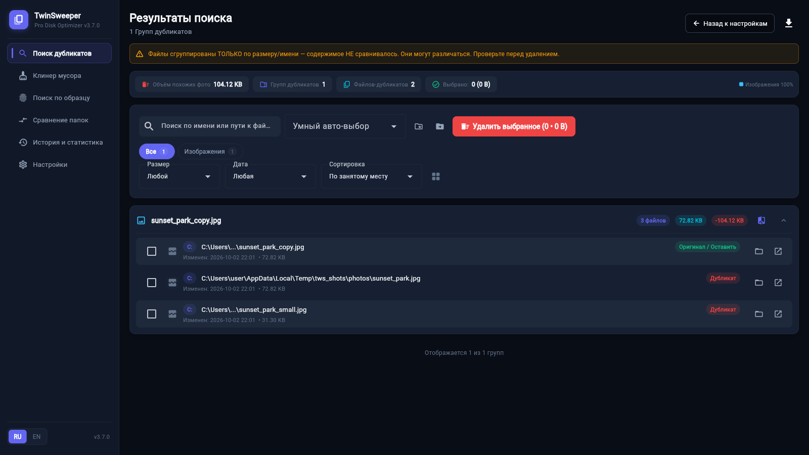
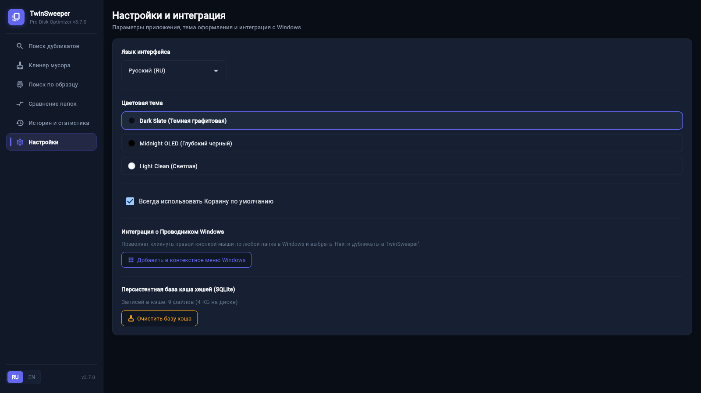

<p align="center">
  
</p>

# TwinSweeper

Находит и безопасно удаляет дубликаты файлов, похожие фото и мусор. Портативный EXE для Windows — без установки.

[](https://github.com/Harbuzilia/TwinSweeper/releases/latest)
[](https://github.com/Harbuzilia/TwinSweeper/actions/workflows/ci.yml)
[](LICENSE)
[](https://learn.microsoft.com/windows/release/health/windows10-release-health)

## ⬇ Скачать

**[TwinSweeper.exe → Releases](https://github.com/Harbuzilia/TwinSweeper/releases/latest)** — Windows 10/11 x64, Python не нужен, ничего не устанавливается.

## Скриншоты

<p align="center">
  
</p>
<p align="center">
  
</p>
<p align="center">
  
</p>
<p align="center">
  
</p>

EXE не подписан, поэтому SmartScreen может показать «Windows защитил вас». Сверьте
файл и запустите: «Подробнее» → «Выполнить в любом случае».
Контрольная сумма для сверки — в Release-нотах, проверить можно так:
`certutil -hashfile TwinSweeper.exe SHA256`.

## Что умеет

- **Дубликаты — быстро и точно** — предварительный хэш отсеивает кандидатов, каждая
  группа подтверждается полным сравнением содержимого; повторные сканы берутся из кэша.
- **Похожие фото** — находит визуально похожие снимки с разными именами, размерами и
  EXIF-поворотом, но никогда не считает их дубликатами и не выделяет к удалению.
- **Умное автовыделение** — одно правило вместо ручной возни: оставить новейший,
  старейший, самый большой или копию из приоритетной папки.
- **Приоритетные папки** — «держать файлы из `D:\Photos`, чистить остальные».
- **Поиск по образцу** — «найди все копии этого файла» по содержимому.
- **Сравнение папок** — что уникально в каждой стороне и что общего, без учёта регистра имён.
- **Клинер мусора** — пустые папки, битые ярлыки и файлы мусора одним проходом.
- **Освобождение места без потери структуры** — байт-в-байт одинаковые файлы заменяются
  NTFS-хардлинками: место освобождается, пути и папки остаются как были.
- **Переместить вместо удалить** — обратимое перемещение в выбранную папку.
- **Журнал и отмена** — каждая операция записана, отменяется из журнала, даже если
  прервалась на середине.
- **Экспорт и история** — результаты в CSV/JSON/TXT/HTML, история сканирований.
- **Два языка, две темы** — RU/EN и тёмная/светлая, настройки сохраняются между запусками.

## 🛡 Ваши данные под защитой

- **Корзина по умолчанию** — удаление идёт через корзину Windows; если она
  недоступна, действие прерывается, а не превращается в безвозвратное удаление.
- **Полная сверка содержимого** — размер и имя файла никогда не считаются
  доказательством: каждая группа дубликатов подтверждается по всему содержимому.
- **Перепроверка перед удалением** — в момент операции файл сверяется со снимком
  скана; изменился — операция отменяется, файл остаётся.
- **В группе всегда остаётся копия** — даже «выделить всё» не удалит последнюю копию.
- **Отмена из журнала** — удаление, хардлинк и перемещение можно откатить.
- **Полностью офлайн** — приложение не делает сетевых запросов и ничего никуда не
  отправляет; что и где хранится — в [`docs/PRIVACY.md`](docs/PRIVACY.md).

Полный список механизмов — в [`docs/SAFETY.md`](docs/SAFETY.md) («10 гарантий корректности»).

## 🚀 Быстрый старт

1. Скачайте EXE и запустите — установка не требуется.
2. Выберите диск или папки для проверки (можно перетащить в окно).
3. Нажмите «Найти дубликаты» — дождитесь сканирования.
4. Проверьте результаты и удалите лишнее или переместите — отмена доступна в журнале.

## Запуск из исходников

Windows 10/11, Python 3.12+:

```bat
python -m venv venv
venv\Scripts\pip install -r requirements-dev.txt
venv\Scripts\python main.py
```

Тесты, линт, сборка EXE и структура проекта — в [`docs/DEVELOPMENT.md`](docs/DEVELOPMENT.md).

## Где хранятся данные

| Файл | Назначение |
|---|---|
| `scan_cache.db` | кэш хэшей (ускоряет повторные сканирования) |
| `operations_log.json` | журнал операций, основа для отмены |
| `scan_history.json` | история сканирований |
| `twinsweeper.log` | журнал работы приложения (ротация ~1 МБ × 3) |

- При запуске из исходников — в каталоге проекта.
- В собранном EXE — `%LOCALAPPDATA%\TwinSweeper`.

## Что нового

История изменений — в [CHANGELOG.md](CHANGELOG.md), список релизов — в
[Releases](https://github.com/Harbuzilia/TwinSweeper/releases).

## Помощь проекту

Баги и идеи — в [Issues](https://github.com/Harbuzilia/TwinSweeper/issues).
Issue — лучший способ сообщить о проблеме: приложение полностью офлайн, так что
информация придёт только от вас.

## Лицензия

[MIT](LICENSE) — свободное использование, модификация и распространение с сохранением
уведомления об авторских правах.
