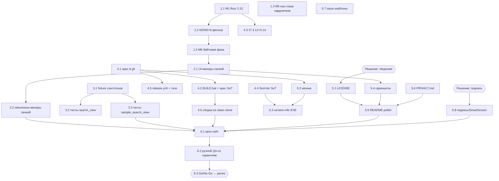

# Duplicater — план доведения до рыночного релиза (go-to-market)

> Формат: адаптация скилла `writing-plans` под релизный план — гранулярность задач
> **до полдня** (по требованию владельца), каждая задача обязательна иметь:
> файлы, действия, **команду проверки** и **критерий готовности**. Чекбоксы
> обновляются по ходу (`- [x]`).
>
> Основание: свежий аудит (M1–M6 + миноры) — суть во входе оркестратора, точные
> строки верифицированы по коду 2026-10-02; исторический `AUDIT_REPORT.md` в корне —
> это раунды 1–3 от 2026-09-17 с **другой** нумерацией M1–M10, не путать.
>
> **Версия релиза (предложение, решение за владельцем):** SemVer `3.7.0`.
> Обоснование: изменения — корректность/безопасность данных + полировка, без
> ломки контрактов → патч-минорная. `4.0.0` оправдан только если позиционировать
> релиз как «перезапуск продукта» (новый маркетинг, сайт). См. «Открытые решения».

## Порядок этапов и почему именно такой

1. **Correctness** — M1–M3/M5/M6 трогают безопасность данных пользователя
   (удаление/хардлинки). Нельзя полировать и продавать то, что может удалить
   «не тот» файл. Риск данных → первым.
2. **Гигиена пачкой** — миноры не угрожают данным, но портят впечатление;
   чинятся дёшево одним-двумя PR. Стабильность → вторым.
3. **Тестовое покрытие** — новые тесты фиксируют поведение этапов 1–2
   (регрессионный щит) и закрывают два полностью непокрытых UI-модуля.
4. **Релизная инженерия** — сборка/CI/версия/тег становятся воспроизводимыми
   и автоматическими. Не имеет смысла до фиксов (иначе пересборки).
5. **Рыночные артефакты** — лицензия, иконка, скриншоты, privacy, шаблоны issues.
   Требуют решений владельца, работают поверх стабильной сборки.
6. **QA-гейт** — финальная верификация всего на собранном EXE + go/no-go.

Конвенции (обязательны для всех задач): Conventional Commits без эмодзи; один
коммит = один смысловой шаг; деструктивные пути держат инвариант
verify→act→journal в `finally`; тесты изолированы через `DUPLICATER_DATA_DIR`
(`tests/conftest.py`); логика — отдельные PR с полным прогоном
(`python -m pytest tests/ -q` + `python -m ruff check .`), косметика — пачкой.

Размеры: **S** ≤ 2 ч, **M** ≤ полдня, **L** ≤ день.

---

## Этап 1 — Correctness (безопасность данных)

### 1.1. [M1] Унификация Python floor: честный 3.12+
- **Размер:** S · **Исполнитель:** coder · **Зависимости:** нет
- **Файлы:** `README.md` (раздел «Требования»), `ruff.toml:5` (`target-version = "py39"`), `scanner.py:301,570` (комментарий-якорь)
- **Вход:** `os.path.isjunction` существует только с Python 3.12; README
  заявляет 3.10+ → `AttributeError`-краш на 3.10/3.11 в обоих walk-циклах
  (`scanner.py:301`, `scanner.py:570`); ruff настроен на py39 — дрейф.
- **Действия (вариант A, рекомендованный):** floor 3.12. README — «Python 3.12+»;
  `ruff.toml` → `target-version = "py312"`; комментарий у `isjunction`-вызовов:
  «Python 3.12+ (os.path.isjunction)». Обоснование: релизный EXE несёт свой
  Python, исходники запускают разработчики — shim с
  `getattr(os.path, "isjunction", lambda p: False)` молча ломает прунинг
  (junction считается папкой → двойной обход), т.е. вариант B хуже отказа.
  Вариант B (shim + реальный 3.10-support) — только если владелец настоит.
- **Проверка:** `python -m ruff check . && python -m pytest tests/ -q`;
  `grep -n "3.10" README.md` — пусто; `grep -n "py39" ruff.toml` — пусто.
- **Критерий готовности:** ни один файл не заявляет Python < 3.12; suite зелёный.
- **Не входит:** CI-матрица (задача 4.3), пересмотр других API на floor.

### 1.2. [M2/M3] Общий fs-фильтр: junction/$Recycle.Bin/SVI + inode-дедуп для всех трёх сканеров
- **Размер:** M · **Исполнитель:** coder (+ reviewer) · **Зависимости:** нет (но до 1.4 — оба трогают `scanner.py`)
- **Файлы:** новый `fs_filters.py` (имя рабочее), `scanner.py:275–330,554–590` (вынести), потребители: `phash_scanner.py:120`, `sweeper.py:31,186,232`; тесты `tests/test_fs_filters.py` + случаи в `tests/test_phash_scanner.py`, `tests/test_sweeper.py`
- **Вход:** прунинг junction/symlink (`scanner.py:301,570`), системных папок
  ($Recycle.Bin, System Volume Information — компонентный матчинг, не подстрока)
  и inode-дедуп (hardlink-алиасы) реализованы **только** в `scanner.py`.
  `phash_scanner.py:120` и `sweeper.py:31,186,232` ходят `os.walk(followlinks=False)`
  без прунинга: junction внутрь дерева не «follow», но **сам узел-junction
  засчитывается** как обычная папка, $Recycle.Bin/SVI сканируются, hardlink-алиас
  изображения даёт две записи одного inode.
- **Действия:** вынести в один модуль фильтры: (a) прунинг dirs-in-place для
  topdown-обходов; (b) предикат системной папки по компонентам пути; (c)
  inode-дедуп через `st_ino/st_dev` (паттерн уже есть в `scanner.py`). Заменить
  инлайн-код в `scanner.py` вызовами хелпера; применить в phash- и sweeper-обходах
  (sweeper:31 — topdown=False — проверить, что прунинг корректен для
  восходящего обхода; при необходимости сменить на topdown=True с прунингом,
  сохранив семантику «вложенные пустые деревья за один проход»).
- **Проверка:** `python -m pytest tests/ -q`. Новые тесты: junction наружу
  корня (паттерн `_mkjunction` + skip-guard из `tests/test_scanner.py:376–393`)
  не попадает в результаты **phash**; папка `$Recycle.Bin\...` с мусорным
  файлом не попадает в кандидаты **sweeper**; hardlink-алиас изображения не
  даёт дубликата inode в phash-группе.
- **Критерий готовности:** три сканера используют один хелпер; grep по
  `isjunction|Recycle|System Volume` находит системные константы только в
  `fs_filters.py`; все тесты зелёные; поведение на «чистых» деревьях
  (без junction) не изменилось (существующие тесты — доказательство).
- **Не входит:** M5/M6 (перф), compare-режимы `scanner.py:659,672` (их семантика
  «обе стороны как есть» — отдельное решение, если понадобится).

### 1.3. [M5] Кэш хэша оригинала на группу в хардлинк-батче
- **Размер:** S/M · **Исполнитель:** coder · **Зависимости:** нет
- **Файлы:** `hardlink_manager.py:93–95` (`replace_with_hardlink`), `hardlink_manager.py:158` (`batch_replace_with_hardlinks`), `tests/test_hardlink_manager.py`
- **Вход:** `replace_with_hardlink` на **каждую** пару перечитывает **оба** файла
  полным SHA-256 (`hardlink_manager.py:93–94`). В батче N дубликатов оригинал
  хэшируется N раз. Инвариант безопасности: цель (дубликат) обязана
  перепроверяться перед заменой; оригинал — тоже, но его повторные чтения
  избыточны, если он не менялся.
- **Действия:** в `batch_replace_with_hardlinks` вычислить хэш оригинала группы
  один раз и передать в `replace_with_hardlink` (новый опциональный параметр
  `precomputed_src_hash`); перед каждым переиспользованием — дешёвая
  ревалидация по `stat` (размер+mtime): не совпало → перечитать хэш заново.
  Хэш дубликата всегда вычисляется свежо (файл-то будут заменять).
- **Проверка:** `python -m pytest tests/test_hardlink_manager.py -q` + полный
  suite. Новый тест: monkeypatch-счётчик вызовов `get_file_hash` на группе из
  1 оригинала + 5 дубликатов → вызовов ≤ 6 (1 оригинал + 5 дубликатов), а не 10;
  тест-инвариант: подмена дубликата между сканом и операцией → замена
  отклоняется (verify→act сохранён).
- **Критерий готовности:** счётчик-тест зелёный; инвариант-тест зелёный;
  существующие тесты хардлинков зелёные.
- **Не входит:** кэширование хэша дубликатов, SQLite-интеграция.

### 1.4. [M6] Байтовая фаза: O(n) чтений и устранение двойного доказательства
- **Размер:** M · **Исполнитель:** coder (+ reviewer) · **Зависимости:** после 1.2 (общий файл `scanner.py`)
- **Файлы:** `scanner.py:484–511` (Phase 3, byte-by-byte), `scanner.py:202` (`compare_byte_by_byte`), `scanner.py:367` (валидация критериев), `tests/test_scanner.py`
- **Вход:** (a) для группы из n файлов фаза перечитывает опорный файл n−1 раз
  (каждый `compare_byte_by_byte(current, other)` читает оба файла целиком);
  (b) при включённом `by_hash` группы уже доказаны **полным SHA-256** (стандарт
  доказательств проекта, README:9 «обязательная проверка полным SHA-256») —
  байтовая фаза повторяет то же доказательство дороже.
- **Действия:** (1) при `by_hash=True` — пропускать байтовую фазу для групп,
  собранных по полному хэшу (коллизия SHA-256+равный размер вне модели риска
  проекта; задокументировать в CHANGELOG как изменение семантики дублирования);
  (2) при byte-only (`by_hash=False, by_byte=True`) — читать опорный файл один
  раз на группу: кэш содержимого/хэша-префикса опорного файла на время группы
  (или first-difference буферизацией — реализация на исполнителя, контракт ниже).
- **Проверка:** `python -m pytest tests/test_scanner.py -q` + полный suite.
  Новый тест: счётчик вызовов `compare_byte_by_byte`/открытий опорного файла на
  группе из 5 → ≤ 5 чтений контента, не 9; тест-эквивалентность: hash+byte режим
  выдаёт те же группы, что до изменения (fixture-группы).
- **Критерий готовности:** оба теста зелёные; существующие suite-тесты
  (включая турбо-режим) зелёные; CHANGELOG-запись о семантике есть.
- **Не входит:** `scanner.py:709` (byte-compare в похожести — отдельная
  семантика), UI-предупреждение byte-only (это 2.1e).

**Выход этапа 1:** тег-«якорь» (не релизный): все деструктивные пути
верифицированы, чтения O(n), три сканера фильтруют системные пути одинаково.

---

## Этап 2 — Гигиена пачкой (миноры аудита)

> Правило проекта: косметика пачкой. Логически две пачки — UI/UX и
> robustness; допустимо склеить в один PR по решению координатора, но коммиты
> тематические. Каждая пачка — полный прогон suite+lint.

### 2.1. Пачка UI/UX-миноров (PR `refactor(ui): пачка миноров из аудита`)
- **Размер:** M · **Исполнитель:** coder · **Зависимости:** после 1.4 (штампы на `scanner.py`/`search_view` параметрах)
- **Файлы и пункты:**
  - `ui/compare_view.py` — результаты сравнения папок без пагинации: применить
    паттерн постраничного рендера из `ui/results_view.py` (если есть) либо
    «Показать ещё N» — точную строку уточнить по коду на момент выполнения;
  - `main.py:1038–1039` + `db_cache.py:184` + `locales.py:260,579` — «Кэш
    очищен» показывается безусловно: `clear_cache` возвращает факт/число строк,
    сообщение — по результату; добавить ключ ошибки RU+EN;
  - `ui/search_view.py` — поиск (фильтр по имени) без debounce: отложить
    перерисовку на ~250 мс после последнего ввода;
  - `ui/results_view.py:965` (`show_image_lightbox`) — лайтбокс минует кэш
    миниатюр (`ui/thumbnails.py`): показывать thumbnail немедленно, полноразмерное
    изображение грузить после (progressive);
  - `ui/search_view.py` + `locales.py` — при `by_byte` без `by_hash` нет
    предупреждения (байтовое сравнение читает файлы целиком — медленно):
    non-blocking warning-текст, RU+EN;
  - `README.md:1` — титул `v3.6` → синхронизировать с `app_info.py:5` (сейчас 3.7).
- **Проверка:** `python -m ruff check . && python -m pytest tests/ -q`;
  точечные тесты где дёшево: сообщение об очистке кэша (успех/провал), warning
  при byte-only; ручной smoke экранов сравнения/результатов.
- **Критерий готовности:** все 6 пунктов закрыты; suite зелёный; ни один пункт
  не меняет протокол безопасности данных.
- **Не входит:** пагинация results_view (уже есть?), память (2.2f).

### 2.2. Пачка robustness-миноров (PR `fix: пачка robustness-миноров из аудита`)
- **Размер:** M · **Исполнитель:** coder · **Зависимости:** после 2.1 (конфликты в `main.py`)
- **Файлы и пункты:**
  - `ops_log.py:141` (`undo_hardlink_operation`) — undo без `makedirs`:
    `os.makedirs(parent, exist_ok=True)` перед восстановлением файла; тест:
    родительская папка удалена → undo восстанавливает файл;
  - `main.py:209,365` (`_reserve_destination`) — вызов вне try: обернуть,
    исключение → журналируемая ошибка пользователю, не падение потока;
  - `ui/components.py:83` (`set_active_theme`) — мутирует `sys.modules`:
    рефактор на локальную таблицу активной темы без мутации глобального
    состояния модулей; тест: смена темы дважды не оставляет следов в `sys.modules`;
  - `db_cache.py:74–187` — sqlite-соединения не закрываются (thread-local,
    `check_same_thread=False`): гарантированное закрытие (context-manager/finally
    на уровне операции или явный `close()`); тест: connection закрывается /
    повторное использование работает;
  - `ui/compare_view.py:48,172,186,220,231` (`_compare_busy`) — сброс в двух
    местах (220, 231): привести к `try/finally` с одной точкой сброса; расширить
    `tests/test_compare_view.py:84–97`;
  - `scanner.py` — FileInfo/Future без memory ceiling на огромных сканах:
    батчевая обработка/backpressure; **оговорка:** если оценка > полдня —
    вынести в отдельную задачу с собственными тестами, не блокируя пачку.
- **Проверка:** `python -m ruff check . && python -m pytest tests/ -q`;
  точечные тесты на пункты a/b/d/e (выше).
- **Критерий готовности:** все пункты закрыты (или f вынесен с трекингом);
  suite зелёный; деструктивные пути сохранили verify→act→journal.
- **Не входит:** новые фичи, локализация новых языков.

**Выход этапа 2:** два PR смержены, полный suite+lint зелёные, CHANGELOG
заполнен по правилу «после каждого изменения».

---

## Этап 3 — Тестовое покрытие

### 3.1. Fixture `fresh_cache_db` подменяет синглтоны обоих сканеров
- **Размер:** S · **Исполнитель:** tester · **Зависимости:** нет (но до 3.2/3.3)
- **Файлы:** `tests/conftest.py:44–51` (`fresh_cache_db`), возможно `tests/test_conftest.py` (новый)
- **Вход:** докстринг fixture (conftest.py:47–49) заявляет save/restore
  модульного синглтона, но подмены `scanner.cache_db` и
  `phash_scanner.cache_db` фактически нет → тесты, идущие через модульные
  синглтоны, могут писать в общий кэш и зависеть друг от друга.
- **Действия:** fixture monkeypatch-ит `scanner.cache_db` и
  `phash_scanner.cache_db` на свой экземпляр, restore в finally; тест-доказательство:
  внутри теста `scanner.cache_db is fresh_cache_db` и `phash_scanner.cache_db is fresh_cache_db`.
- **Проверка:** `python -m pytest tests/ -q` дважды подряд (нет кросс-тестового
  загрязнения); новый тест fixture зелёный.
- **Критерий готовности:** тест-доказательство зелёное; двойной прогон suite
  стабильно зелёный.
- **Не входит:** рефактор самих синглтонов в прод-коде.

### 3.2. Тесты `ui/search_view.py` (553 строки, покрытие 0)
- **Размер:** M · **Исполнитель:** tester · **Зависимости:** после 3.1, 2.1 (проверяем новое поведение)
- **Файлы:** новый `tests/test_search_view.py`; референс-паттерны: `tests/test_sweeper_view.py`, `tests/test_results_view.py`
- **Действия:** покрыть по готовому headless-паттерну: маппинг формы →
  параметры скана; валидация min>max; чипы быстрых дисков; warning при
  byte-only (после 2.1e); debounce (после 2.1c); старт/отмена скана.
- **Проверка:** `python -m pytest tests/test_search_view.py -q` + полный suite.
- **Критерий готовности:** ≥ 15 тестов, покрывающих перечисленное; все зелёные.
- **Не входит:** визуальные/скриншот-тесты (QA-гейт 6.2).

### 3.3. Тесты `ui/sample_search_view.py` (345 строк, покрытие 0)
- **Размер:** M · **Исполнитель:** tester · **Зависимости:** после 3.1
- **Файлы:** новый `tests/test_sample_search_view.py`
- **Действия:** выбор файла-образца; ошибки (образец исчез/недоступен);
  отображение результатов; сценарий «похожие ≠ предвыделено к удалению».
- **Проверка:** `python -m pytest tests/test_sample_search_view.py -q` + suite.
- **Критерий готовности:** ≥ 10 тестов, зелёные; в тестах не создаётся
  предвыделение к удалению (инвариант README).

**Выход этапа 3:** 2 новых тест-файла, все непокрытые UI-модули закрыты,
изоляция кэша доказана тестом.

---

## Этап 4 — Релизная инженерия

### 4.1. `Duplicater.spec` под git (сейчас игнорируется `*.spec`)
- **Размер:** S · **Исполнитель:** coder · **Зависимости:** нет (до 4.2!)
- **Файлы:** `.gitignore:14` (`*.spec`), `Duplicater.spec`
- **Вход:** **найдено верификацией плана:** `.gitignore:14` содержит `*.spec`,
  т.е. `Duplicater.spec` (источник сборки) не версионируется — сборка из
  чистого клона и CI-релиз невозможны, upx/collect-all живут только на машине
  разработчика.
- **Действия:** добавить в `.gitignore` после `*.spec` строку
  `!Duplicater.spec`; `git add Duplicater.spec`; коммит
  `build: версионировать Duplicater.spec как источник сборки`.
- **Проверка:** `git check-ignore -v Duplicater.spec` — не игнорируется;
  `git status --short` — spec закоммичен; чистый клон содержит spec.
- **Критерий готовность:** spec в репо; `*.spec`-мусор PyInstaller всё ещё
  игнорируется.
- **Не входит:** содержимое spec (правится в 4.2/5.2/5.3).

### 4.2. [M4] BUILD.bat: honest errors + spec как единственный источник сборки
- **Размер:** S/M · **Исполнитель:** coder · **Зависимости:** после 4.1
- **Файлы:** `BUILD.bat:23,53–54,58`
- **Вход:** build-ветка ставит только `requirements.txt` (PyInstaller живёт в
  `requirements-dev.txt:5`) → на чистой машине `python -m PyInstaller` падает;
  ошибки pip глушатся (`>nul 2>&1`, `>nul`) → «BUILD COMPLETE» поверх провала;
  сборка CLI-флагами (`BUILD.bat:58`) мимо `Duplicater.spec` (upx=True и
  collect-all — только в spec) → два расходящихся источника сборки.
- **Действия:** (a) build: `pip install -r requirements-dev.txt`; (b) убрать
  глушение stderr у pip/PyInstaller, после каждого шага `if errorlevel 1`
  → сообщение + `exit /b 1`; (c) сборка только
  `python -m PyInstaller --noconfirm Duplicater.spec`; (d) пост-проверка
  `if not exist dist\Duplicater.exe` → ошибка; (e) run-ветка (BUILD.bat:23):
  не глушить ошибки pip; (f) удалить дублирующие CLI-флаги.
- **Проверка:** на чистом venv: `BUILD.bat` → [2] → EXE создан и запускается;
  негативный тест: временно битый `requirements.txt` → скрипт падает с
  сообщением, «BUILD COMPLETE» не печатается.
- **Критерий готовности:** оба сценария проходят; единственный способ сборки
  EXE — spec.
- **Не входит:** иконка/version-info (5.2/5.3), подпись (5.8).

### 4.3. CI-матрица Python 3.12 + 3.14
- **Размер:** S · **Исполнитель:** coder · **Зависимости:** после 1.1
- **Файлы:** `.github/workflows/ci.yml:15–17`
- **Действия:** `python-version: "3.13"` → matrix `["3.12", "3.14"]` (floor
  релиза + newest; 3.13 покрыта диапазоном). Если 3.14 красная по вине
  Flet/PyInstaller — зафиксировать issue и решить: поднять floor-среду,
  пометить `continue-on-error` **запрещено** без решения владельца.
- **Проверка:** push → оба джоба CI зелёные.
- **Критерий готовности:** зелёная матрица 3.12+3.14 в CI.
- **Не входит:** другие ОС (приложение Windows-only).

### 4.4. Версионирование: единый SemVer-источник `app_info.py`
- **Размер:** S · **Исполнитель:** coder · **Зависимости:** нет (до 5.3)
- **Файлы:** `app_info.py:5`, `README.md:1`, `CHANGELOG.md` (заголовок записи)
- **Действия:** `APP_VERSION = "3.7"` → `"3.7.0"` (3 компоненты нужны для
  version-info EXE); grep потребителей `APP_VERSION` — убедиться, что формат
  нигде не парсится как 2 компоненты (если парсится — поправить); README титул
  и CHANGELOG — синхронно.
- **Проверка:** `python -c "from app_info import APP_VERSION; assert APP_VERSION == '3.7.0'"`;
  `grep -rn "APP_VERSION" --include=*.py` — consumers целы; suite зелёный.
- **Критерий готовности:** версия в одном месте, формат SemVer, consumers живы.
- **Не входит:** bump до 4.0.0 (открытое решение).

### 4.5. Release-процесс: tag → GitHub Release с артефактами
- **Размер:** M · **Исполнитель:** coder · **Зависимости:** после 4.1, 4.2, 4.4
- **Файлы:** новый `.github/workflows/release.yml`, `CHANGELOG.md`
- **Действия:** workflow на push тега `v*`: windows-latest → install
  requirements-dev → ruff+pytest (короткий гейт) → `PyInstaller Duplicater.spec`
  → `sha256sum dist/Duplicater.exe > SHA256SUMS.txt` → GitHub Release
  (EXE + SHA256SUMS + выдержка из CHANGELOG). В CHANGELOG — релизная секция
  сверху: «v3.7.0 — дата — итоги M1–M6, миноры, покрытие, маркетинг».
- **Проверка:** прогон через тестовый тег `v0.0.0-rc.1` на ветке → Release
  создан, артефакты приложены, sha256 сходится (скачать и сверить).
- **Критерий готовности:** rc-релиз воспроизводится из тега одной командой
  `git tag && git push --tags`.
- **Не входит:** публикация в winget/сайте (открытое решение), подпись (5.8).

### 4.6. Чистовая сборка из clean clone (дымовой тест сборки)
- **Размер:** S · **Исполнитель:** coder · **Зависимости:** после 4.1, 4.2
- **Файлы:** — (процедура; фиксация в CHANGELOG/PR-описании)
- **Действия:** свежий клон во временную папку → `BUILD.bat` [2] → EXE
  запускается, версия в «О программе» = APP_VERSION.
- **Проверка:** EXE стартует, показывает 3.7.0, скан tmp-папки с 2 дубл. файлами
  работает, `duplicater.log` пишется рядом.
- **Критерий готовности:** сборка из клона без ручных шагов.
- **Не входит:** полный QA (этап 6).

**Выход этапа 4:** сборка/CI/версия/релиз воспроизводимы и автоматизированы;
rc-тег уже умеет публиковать Release с артефактами.

---

## Этап 5 — Рыночные артефакты

### 5.1. LICENSE (внедрение после решения владельца)
- **Размер:** S · **Исполнитель:** coder · **Зависимости:** **решение владельца №1**
- **Файлы:** новый `LICENSE`, `README.md` (раздел «Лицензия»)
- **Вход:** в корне LICENSE **нет** (проверено) → по умолчанию «all rights
  reserved», публичный релиз без лицензии юридически и репутационно уязвим
  (никто не имеет права легально использовать/форкать).
- **Действия:** после выбора варианта (см. «Открытые решения», таблица
  трейдоффов) — файл LICENSE в корень, раздел в README, при выборе
  permissive — опционально короткие заголовки в исходниках.
- **Проверка:** `LICENSE` существует; GitHub распознаёт тип (бейдж справа);
  README ссылается.
- **Критерий готовности:** лицензия выбрана владельцем, файл в git.
- **Не входит:** выбор лицензии вместо владельца.

### 5.2. Иконка приложения + проводка в spec
- **Размер:** M · **Исполнитель:** coder (иконку — externalscout/дизайн по возможности) · **Зависимости:** после 4.1
- **Файлы:** новый `assets/icon.ico` (16/32/48/64/128/256), `Duplicater.spec` (EXE-блок, после `name='Duplicater'`), опционально `main.py` (иконка окна flet)
- **Действия:** создать/получить многослойный .ico; `icon='assets/icon.ico'` в
  EXE(); иконка окна приложения; вложить assets в spec datas, чтобы доступна
  рантайму (если нужна окну).
- **Проверка:** пересобрать → EXE в Explorer/таскбаре с иконкой; окно с иконкой;
  `python -m pytest tests/ -q` (не сломали сборку).
- **Критерий готовности:** иконка видна в Explorer, таскбаре и заголовке окна.
- **Не входит:** логотип-кампания, брендинг README (5.5).

### 5.3. Version-info ресурс EXE (Properties → Details)
- **Размер:** S · **Исполнитель:** coder · **Зависимости:** после 4.4, 5.2 (порядок правок spec)
- **Файлы:** новый `version_info.txt` (PyInstaller VSVersionInfo), `Duplicater.spec`
- **Действия:** VSVersionInfo: FileVersion=ProductVersion=`3.7.0` (значение —
  `from app_info import APP_VERSION` прямо в spec → единый SoT),
  FileDescription «Duplicater — поиск и безопасное удаление дубликатов»,
  ProductName «Duplicater», Copyright, OriginalFilename `Duplicater.exe`;
  `version='version_info.txt'` в EXE().
- **Проверка:** пересборка → Properties EXE → Details: версия продукта 3.7.0,
  имя, описание; изменить APP_VERSION → пересборка → ресурс обновился.
- **Критерий готовности:** Properties показывает данные из app_info без
  ручного дублирования.
- **Не входит:** цифровая подпись (5.8).

### 5.4. Скриншоты для README
- **Размер:** S/M · **Исполнитель:** coder (или ui-спец) · **Зависимости:** после 2.1 (полированный UI)
- **Файлы:** новые `docs/screenshots/*.png` (6 шт.: поиск, результаты+автовыделение, похожие фото, клинер, сравнение папок, настройки), `README.md`
- **Действия:** снять RU-локаль, аккуратные тестовые данные; сжать (≤300 КБ/шт);
  секция «Скриншоты» в README после «Возможностей».
- **Проверка:** README на GitHub рендерит все 6 изображений (проверить
  рендер PR-превью или браузером).
- **Критерий готовности:** скриншоты в git и в README, ссылки живые.
- **Не входит:** видео/GIF (опционально позже).

### 5.5. README polish под рынок
- **Размер:** M · **Исполнитель:** coder (+ externalscout для текста) · **Зависимости:** после 5.1, 5.4, 5.6 (ссылки)
- **Файлы:** `README.md`
- **Действия:** титул с версией; бейдж CI; «Установка» — ссылка на GitHub
  Releases + «EXE не требует Python», «Windows 10/11»; из исходников — Python
  3.12+; секция Скриншоты; ссылка на PRIVACY; раздел Лицензия; FAQ: SmartScreen
  («Windows защитил вас» → «Подробнее → Выполнить в любом случае» + почему:
  нет подписи — см. 5.8/решение №2); сверка «10 гарантий» с фактическим
  поведением (результаты 6.2).
- **Проверка:** docs-sync-проход: версия/ссылки/требования согласованы
  (`grep -n "3.6\|3.10" README.md` пусто; все относительные ссылки существуют).
- **Критерий готовности:** README согласован со всеми артефактами, англ. не
  требуется (язык — открытое решение №6).
- **Не входит:** перевод README (решение владельца).

### 5.6. Заявление о приватности `docs/PRIVACY.md`
- **Размер:** S · **Исполнитель:** coder · **Зависимости:** нет
- **Файлы:** новый `docs/PRIVACY.md`, `README.md` (ссылка)
- **Действия:** зафиксировать факты (проверяемые по коду): приложение полностью
  оффлайн, телеметрии/сетевых вызовов нет; что хранится локально и где
  (SQLite-кэш `scan_cache.db`, журнал `operations_log.json`, история
  `scan_history.json`, лог `duplicater.log`); удаление следов — «Очистить кэш»
  в настройках + ручное удаление файлов; политика данных корзины.
- **Проверка:** `grep -rn "requests\|urllib\|http" --include=*.py` — сетевых
  вызовов нет (факт для текста); файл существует, ссылка из README жива.
- **Критерий готовности:** PRIVACY.md отражает только проверяемые факты кода.
- **Не входит:** EN-версия (решение №6).

### 5.7. Issue-шаблоны GitHub
- **Размер:** S · **Исполнитель:** coder · **Зависимости:** нет
- **Файлы:** новые `.github/ISSUE_TEMPLATE/bug_report.md` (или .yml-форма), `.github/ISSUE_TEMPLATE/feature_request.md`
- **Действия:** bug-форма: версия приложения (из «О программе»), сборка ОС
  (winver), шаги воспроизведения, ожидал/получил, прикрепить `duplicater.log`
  (путь объяснить), скриншот; feature — user story + сценарий.
- **Проверка:** структура `.github/ISSUE_TEMPLATE/` валидна; превью на GitHub
  (New issue) показывает формы.
- **Критерий готовности:** шаблоны рендерятся, язык RU (или EN — №6).
- **Не входит:** discussions/уроки поддержки.

### 5.8. Подпись кода / SmartScreen (внедрение после решения владельца)
- **Размер:** M (если подписываем) / S (если нет) · **Исполнитель:** coder · **Зависимости:** **решение владельца №2**; после 4.5
- **Файлы:** `BUILD.bat` (+ signtool после PyInstaller), `.github/workflows/release.yml`, `README.md` (FAQ)
- **Действия (по выбранному варианту, трейдоффы и ориентировочные цены —
  в «Открытых решениях»):** OV/EV-сертификат или Azure Trusted Signing → шаг
  `signtool sign /fd SHA256 /tr <timestamp>` в BUILD.bat и release.yml; вариант
  «без подписи» → только README-FAQ по SmartScreen (5.5) и честная пометка в
  Release-нотах.
- **Проверка:** `Get-AuthenticodeSignature dist\Duplicater.exe` — статус Valid
  (если подпись); скачивание с чистой VM — SmartScreen не появляется (EV/TS)
  или задокументированное поведение.
- **Критерий готовности:** выбранное решение внедрено и проверено на чистой VM.
- **Не входит:** покупка сертификата от имени владельца.

**Выход этапа 5:** репозиторий «продаёт себя»: лицензия, иконка, скриншоты,
privacy, шаблоны, подпись/FAQ — всё согласовано с решениями владельца.

---

## Этап 6 — Финальный QA-гейт

### 6.1. Автоматический гейт на релизной ветке
- **Размер:** S · **Исполнитель:** tester · **Зависимости:** после этапов 1–5
- **Действия:** `python -m ruff check .`; `python -m pytest tests/ -q` (полный,
  дважды); чистая сборка из клона (4.6 повторно на финальном коммите);
  rc-тег → release.yml зелёный, артефакты на месте.
- **Проверка:** все команды зелёные на одном и том же коммите; зафиксировать
  хэш коммита в QA-отчёте.
- **Критерий готовности:** ноль красного на релизном коммите.

### 6.2. Ручной QA-чеклист по гарантиям README (на собранном EXE)
- **Размер:** M · **Исполнитель:** tester (+ владелец по желанию) · **Зависимости:** после 6.1
- **Файлы:** новый `docs/QA_CHECKLIST.md` (заполняется по ходу)
- **Действия:** на EXE из 6.1, в tmp-песочнице (не пользовательские данные!),
  проверить 10+ гарантий из README (README:33–36, развёрнуто):
  1. подтверждение перед каждой деструктивной операцией;
  2. опция «в корзину»: сбой корзины не превращается в безвозвратное удаление;
  3. журнал операций + отмена для удаления;
  4. журнал + отмена для хардлинков (включая кейс «родительская папка
     восстановлена» — после 2.2a);
  5. журнал + отмена для перемещений (файл-источник жив до полной копии);
  6. перепроверка файла на момент операции (подмена файла между сканом и
     удалением → операция отклоняется);
  7. защита группы от выделения целиком (минимум одна копия остаётся);
  8. опустевшие папки — только `os.rmdir`, папка с содержимым не трогается;
  9. турбо-режим: совпадение подтверждается полным SHA-256;
  10. похожие фото: ничего не предвыделено к удалению;
  11. smoke: RU/EN, тёмная/светлая тема, экспорт CSV/JSON/HTML, история.
  Каждый пункт: шаги → ожидание → PASS/FAIL.
- **Проверка:** заполненный `docs/QA_CHECKLIST.md`, все пункты PASS
  (FAIL → баг → этап 1-приоритет, гейт повторяется).
- **Критерий готовности:** 0 FAIL в чеклисте.

### 6.3. Go/No-Go и исполнение релиза
- **Размер:** S · **Исполнитель:** координатор/владелец · **Зависимости:** после 6.1, 6.2 и закрытия всех «Открытых решений»
- **Go-критерии (все обязательны):** 6.1 зелёный; 6.2 без FAIL; LICENSE
  выбран и в git; решение по подписи зафиксировано и внедрено/задокументировано;
  версия SemVer согласована (app_info=README=CHANGELOG=EXE-ресурс); CHANGELOG
  релизная секция готова; открытых P0/P1 из аудита нет.
- **Действия (go):** `git tag -a vX.Y.Z`, push тега → release.yml публикует
  GitHub Release (EXE + SHA256SUMS + changelog) → проверка релиза скачиванием
  на чистой VM → анонс (канал — решение №3).
- **No-go:** любой незакрытый критерий → список blocker'ов владельцу, возврат
  к соответствующему этапу.
- **Критерий готовности:** опубликованный Release, артефакт проверен с чистой
  машины, решения владельца зафиксированы в CHANGELOG/README.

---

## Открытые решения (владелец, НЕ решаются планом)

| № | Решение | Варианты и трейдоффы | Рекомендация плана (не обязательна) |
|---|---------|----------------------|--------------------------------------|
| 1 | **Лицензия** | **MIT** — макс. распространение/форки, мин. требований; **Apache-2.0** — +патентная защита, длиннее; **GPLv3** — copyleft, отпугивает часть юзеров/интеграторов; **проприетарная EULA** — контроль, но ноль доверия open-source-аудитории и юрид. работа | MIT или Apache-2.0 для доверия к «безопасному удалению» (открытость = аргумент доверия) |
| 2 | **Подпись кода / SmartScreen** | (a) без подписи + README-FAQ — бесплатно, трение при первом запуске; (b) OV-сертификат — ~$130–300/год (цены ориентировочные, проверить на момент покупки), репутация набирается скачиваниями; (c) EV-сертификат — ~$250–500+/год, мгновенный проход SmartScreen, токен; (d) Azure Trusted Signing — ~$10/мес, для индивидуальных разработчиков (валидация личности) | (d) Trusted Signing как цена/эффект, иначе (a) на старте + честный FAQ |
| 3 | **Канал дистрибуции** | только GitHub Releases (просто, checksum'ы); + winget-пакет (обнаруживаемость, усилие поддержки); + свой сайт (затраты, SEO) | GitHub Releases на v1 рынка; winget после первых отзывов |
| 4 | **Номер версии** | `3.7.0` (патч-фиксы+полировка — SemVer-честно) vs `4.0.0` (маркетинговый «перезапуск» продукта) | `3.7.0` + фиксация SemVer на будущее |
| 5 | **UPX в релизной сборке** | `upx=True` (сейчас, −размер) → чаще ложные срабатывания AV, хуже для неподписанного EXE; `upx=False` (+3–5 МБ, спокойнее AV/SmartScreen) | `upx=False` для релиза (в spec), пересмотреть при подписи |
| 6 | **Язык рыночных артефактов** | RU-only (аудитория текущая) vs RU+EN (международный охват: README/PRIVACY/issue-шаблоны ×2) | RU-only на v1; EN — быстрая победа позже |

## Риски

| Риск | Вероятность | Воздействие | Митигация |
|------|-------------|-------------|-----------|
| Junction-тесты на CI требуют dev-mode/админа | Средняя | Низкое | skip-guard уже есть (`tests/test_scanner.py:393`); прунинг-логика дополнительно юнит-тестируется на списках путей без реальных junction |
| Python 3.14 несовместим с Flet 0.86.5 / PyInstaller 6.22.2 | Средняя | Среднее | задача 4.3 фиксирует и решает (pin/обсуждение подъёма версий), без молчаливого `continue-on-error` |
| Изменение семантики «byte после SHA-256» (1.4) оспорится | Низкая | Среднее | задокументировать в CHANGELOG; стандарт доказательств проекта уже = полный SHA-256 (README:9); тест-эквивалентность групп |
| Рефактор memory-ceiling (2.2f) регрессирует многопоточность | Средняя | Высокое | правомочен вынос из пачки в отдельную задачу с тестами; полный suite обязателен |
| Spec не в git ломает CI/клон-сборки | Уже обнаружено | Высокое | закрыто задачей 4.1 до любых сборочных задач |
| UPX + неподписанный EXE → ложные срабатывания AV | Высокая | Среднее | решение №5 (рекомендация: off) |
| SmartScreen режет конверсию первого запуска | Высокая | Среднее | решение №2; README-FAQ в любом варианте |
| Цены подписи/сертификатов плавают | Гарантированно | Низкое | в решении №2 помечены как ориентировочные — проверять при покупке |
| Иконки/дизайн — внешняя зависимость | Средняя | Низкое | 5.2 допускает временный генерируемый asset, замена позже |

## Порядок исполнения

Оценка суммарной длительности: ~11–15 рабочих дней одного исполнителя
(этап 1: 1.5–2 дня; этап 2: 1–1.5; этап 3: 1.5–2; этап 4: 1.5–2; этап 5: 2–3
+ внешние решения; этап 6: 1–1.5). Плюс календарное время на решения владельца
(№1–№6) — гейт 6.3 их требует закрытыми.

---

## Чек-лист задач (трекинг)

- [x] 1.1 M1: Python floor 3.12 (README/ruff/comments)
- [x] 1.2 M2/M3: общий fs-фильтр для scanner/phash/sweeper
- [x] 1.3 M5: кэш хэша оригинала в хардлинк-батче
- [x] 1.4 M6: байтовая фаза O(n) + устранение двойного доказательства
- [x] 2.1 UI-миноры пачкой (6 пунктов)
- [x] 2.2 robustness-миноры пачкой (a–e закрыты тестами; f — memory ceiling scanner.py — вынесен в отдельную задачу по оговорке плана)
- [ ] 3.1 fixture fresh_cache_db патчит синглтоны
- [ ] 3.2 тесты ui/search_view.py
- [ ] 3.3 тесты ui/sample_search_view.py
- [x] 4.1 Duplicater.spec в git (теперь TwinSweeper.spec после ребрендинга)
- [ ] 4.2 M4: BUILD.bat honest + spec SoT
- [ ] 4.3 CI-матрица 3.12+3.14
- [ ] 4.4 SemVer 3.7.0 в app_info (SoT)
- [ ] 4.5 release.yml + CHANGELOG-релиз
- [ ] 4.6 чистовая сборка из clean clone
- [x] 5.1 LICENSE (решение №1: MIT)
- [x] 5.2 иконка + spec icon= (+ иконка окна, upx off — решение №5)
- [ ] 5.3 version-info EXE
- [ ] 5.4 скриншоты
- [ ] 5.5 README polish
- [ ] 5.6 docs/PRIVACY.md
- [ ] 5.7 issue-шаблоны
- [ ] 5.8 подпись кода (после решения №2)
- [ ] 6.1 автоматический QA-гейт
- [ ] 6.2 ручной QA-чеклист (10+ гарантий)
- [ ] 6.3 Go/No-Go + релиз
